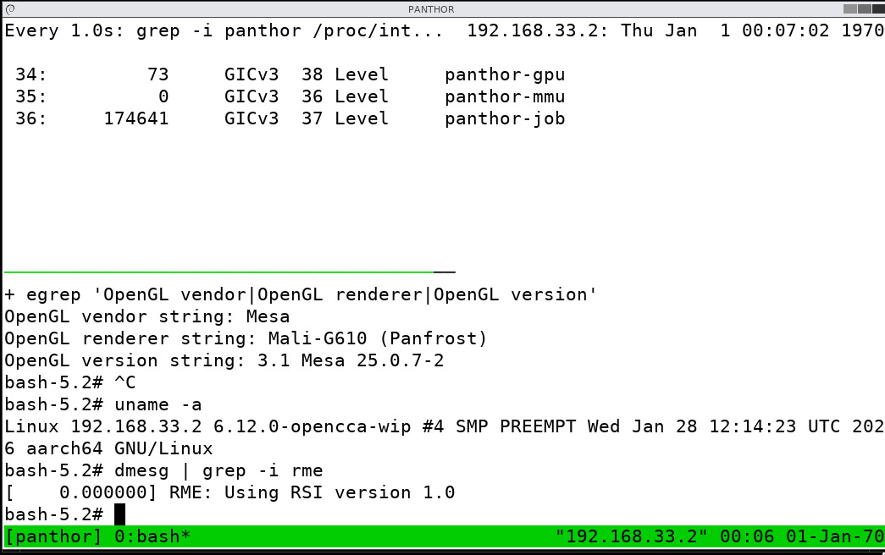

# OpenCCA GPU-in-CVM Demo (RK3588, G610, Panthor)

This repo contains the code used for a live demo that boots a CVM on with opencca, attaches the Mali
G610 GPU, and runs OpenGL inside X, from within the CVM.

The goal of this demo is to show that OpenCCA can be used to rapidly prototype system ideas with Arm
CCA and real devices, going beyond the capabilities of pure software simulation.

https://opencca.github.io/

## What this demo prototypes on OpenCCA
- Boot a Realm VM using kvmtool on opencca
- Expose the Mali G610 GPU to the guest:
  - Provide a GPU node in the guest DT
  - Create Realm NS-accessible stage-2 MMIO mappings for the GPU registers
  - Forward physical GPU interrupts as virtual interrupts injected into the CVM
- Use VKMS (virtual kernel mode setting) to create a fake monitor. This allows us to run the display
  stack without connecting a real monitor to the board.
- Run X with tigervnc in CVM
- Connect to the CVM with vncviewer
- Run OpenGL test inside the CVM renderered on panthor/Mali, not llvmpipe.

- Handle RK3588 specifics:
  - The GPU has no SMMU on the rk3588, so we reserve a chunk of RAM and identity-map IPA = PA so the
    GPU can DMA into guest memory
    
- This is demo code, no proper teardown or error handling was implemented.

## Repositories
Changes for this demo:
- Linux: [fosdem2026-opencca/linux](https://github.com/fosdem2026-opencca/linux)
- Kvmtool: [fosdem2026/kvmtool](https://github.com/fosdem2026-opencca/kvmtool)

### Directory Layout
Set up the opencca repo project layout in the root directory.
```
drwxrwxr-x 1 b b  298 Jan 28 17:55 .
drwxrwxr-x 1 b b   14 Jan 28 12:07 ..
drwxrwxr-x 1 b b  466 Jan 23 15:01 buildroot
drwxrwxr-x 1 b b  586 Jan 23 15:01 debian-image-recipes
drwxrwxr-x 1 b b   84 Jan 28 14:28 demo                    <-- this repository
drwxrwxr-x 1 b b 3124 Jan 23 16:16 kvmtool
drwxrwxr-x 1 b b 2458 Jan 28 14:53 linux
drwxrwxr-x 1 b b   20 Jan 23 15:01 opencca-assets
drwxrwxr-x 1 b b   98 Jan 23 15:01 opencca-build
drwxrwxr-x 1 b b  214 Jan 23 16:57 opencca-flash
drwxrwxr-x 1 b b   64 Jan 23 15:01 opencca-manifest
drwxrwxr-x 1 b b  298 Jan 23 15:06 .repo
drwxrwxr-x 1 b b  122 Jan 23 15:01 rkbin
drwxrwxr-x 1 b b 1328 Jan 23 16:07 snapshot
drwxrwxr-x 1 b b  338 Jan 23 16:06 tf-rmm
drwxrwxr-x 1 b b  706 Jan 23 16:06 trusted-firmware-a
drwxrwxr-x 1 b b 2118 Jan 28 13:57 u-boot
```
## Local Setup
### Network
- Subnet: 10.42.0.0/24
- Laptop: 10.42.0.10
- Raspberry Pi: 10.42.0.20
- RK3588: 10.42.0.30

### Demo 





```sh
# Initial setup on laptop
sudo ./laptop-minicom.sh
sudo ./laptop-sshserver-setup.sh
./network-laptop.sh up
```


```sh
# rk3588:
./host-init-gpu.sh
./host-run-realm-vm-gpu.sh

# cvm
bash
./guest-load-gpu.sh

# laptop
 ./laptop-connect-demo.sh

# in X:
dmesg | grep -i rme
uanme -a
./glxinfo.sh
```

<details>
<summary> UART output RK3588</summary>

```sh
  ___                    ____ ____    _    
 / _ \ _ __   ___ _ __  / ___/ ___|  / \   
| | | | '_ \ / _ \ '_ \| |  | |     / _ \  
| |_| | |_) |  __/ | | | |__| |___ / ___ \ 
 \___/| .__/ \___|_| |_|\____\____/_/   \_\
      |_|                                  

root@debian-rockchip-rock5b-rk3588:/mnt/demo/demo-scripts# ls

Makefile               fosdem.c           guest-run-x.sh  host-init-gpu.sh          laptop-minicom.sh          network-laptop.sh  tmp
cca-platform-token.md  glxinfo.sh         guest.dtb       host-run-realm-vm-gpu.sh  laptop-sshserver-setup.sh  network-rk3588.sh
fosdem                 guest-load-gpu.sh  guest.dts       laptop-connect-demo.sh    minicom.txt                readme.md

root@debian-rockchip-rock5b-rk3588:/mnt/demo/demo-scripts# [   28.913214] platform hdmi1-sound: deferred probe pending: asoc-simple-card: parse error
[   28.913946] platform fdd90000.vop: deferred probe pending: platform: supplier fed70000.phy not ready
[   28.914790] platform fdea0000.hdmi: deferred probe pending: platform: supplier fed70000.phy not ready
[   28.915613] platform hdmi0-sound: deferred probe pending: asoc-simple-card: parse error
ls

Makefile               fosdem.c           guest-run-x.sh  host-init-gpu.sh          laptop-minicom.sh          network-laptop.sh  tmp
cca-platform-token.md  glxinfo.sh         guest.dtb       host-run-realm-vm-gpu.sh  laptop-sshserver-setup.sh  network-rk3588.sh
fosdem                 guest-load-gpu.sh  guest.dts       laptop-connect-demo.sh    minicom.txt                readme.md
root@debian-rockchip-rock5b-rk3588:/mnt/demo/demo-scripts# ./host-
host-init-gpu.sh          host-run-realm-vm-gpu.sh  
root@debian-rockchip-rock5b-rk3588:/mnt/demo/demo-scripts# ./host- 
host-init-gpu.sh          host-run-realm-vm-gpu.sh  

root@debian-rockchip-rock5b-rk3588:/mnt/demo/demo-scripts# ./host-init-gpu.sh 
rmmod: ERROR: Module gpu_poweron is not currently loaded
[   52.634346] gpu_poweron fb000000.gpu: GPU ID: 0xa8670005, shaders: 0x50005
rmmod: ERROR: Module irq is not currently loaded
[   52.678350] irq: debugfs file: demo/irq_router
[   52.678784] irq: loaded

root@debian-rockchip-rock5b-rk3588:/mnt/demo/demo-scripts# ./host-run-realm-vm-gpu.sh 
+ KERNEL=/mnt/demo/demo-scripts/../..//snapshot/Image
+ sudo ip link set tap0 down
+ true
+ sudo ip tuntap del dev tap0 mode tap
+ sudo ip tuntap add dev tap0 mode tap user root
+ sudo ip addr add 192.168.33.1/24 dev tap0
+ sudo ip link set tap0 up promisc on
[   55.223816] tap0: entered promiscuous mode
+ ip addr show tap0
4: tap0: <NO-CARRIER,BROADCAST,MULTICAST,PROMISC,UP> mtu 1500 qdisc pfifo_fast state DOWN group default qlen 1000
    link/ether 4a:f9:5d:62:c1:59 brd ff:ff:ff:ff:ff:ff
    inet 192.168.33.1/24 scope global tap0
       valid_lft forever preferred_lft forever
+ sudo sysctl -w net.ipv4.ip_forward=1
net.ipv4.ip_forward = 1
+ WAN=enP4p65s0
+ LAN=tap0
+ sudo iptables-legacy -t nat -A POSTROUTING -o enP4p65s0 -j MASQUERADE
+ sudo iptables-legacy -A FORWARD -i tap0 -o enP4p65s0 -j ACCEPT
+ sudo iptables-legacy -A FORWARD -i enP4p65s0 -o tap0 -m conntrack --ctstate ESTABLISHED,RELATED -j ACCEPT
+ nice -n -20 taskset 1 /mnt/demo/demo-scripts/../..//snapshot/lkvm run --console virtio -n mode=tap,tapif=tap0,guest_mac=02:aa:bb:cc:dd:01 --realm --restricted
_mem -c 1 -m 512 -k /mnt/demo/demo-scripts/../..//snapshot/Image --9p /,host0 --debug -p 'nokaslr console=hvc0 ip=192.168.33.2::192.168.33.1:255.255.255.0::eth0
:off' --vcpu-affinity 1 --dump-dtb /mnt/demo/demo-scripts/guest.dtb --demo-board-gpu --demo-realm-ns
  Debug: (arm/aarch64/kvm.c) validate_realm_cfg:82: Realm Hash algorithm: Using default SHA256

  Info: # lkvm run -k /mnt/demo/demo-scripts/../..//snapshot/Image -m 512 -c 1 --name guest-568
  Debug: (arm/aarch64/kvm.c) kvm__get_vm_type:184: max_ipa 9fffffff ipa_bits 33 max_ipa_bits 40
  Debug: (arm/aarch64/kvm.c) kvm__arch_enable_mte:216: MTE capability not available
  Debug: (arm/aarch64/kvm.c) kvm__arch_enable_exit_hypcall:239: EXIT HYPERCALL capability not available
  Debug: (arm/kvm.c) kvm__init_ram:103: RAM created at 0x80000000 - 0x9fffffff (host ram_start 0xffff81400000)
  Debug: (arm/kvm.c) kvm__arch_load_kernel_image:178: Loaded kernel to 0x80000000 - 0x831a0000 (51141120 bytes actual)
  Debug: (arm/kvm.c) kvm__arch_load_kernel_image:210: Placing fdt at 0x8fe00000 - 0x8fffffff
  Info: Removed ghost socket file "/root/.[   56.839339] irq: add forwarding: phy=99 -> virt=38 (level)
lkvm//guest-568.sock".
  Info: Opening: /sys/kernel/debug/demo/[   56.840113] irq: add forwarding: phy=100 -> virt=36 (level)
irq_router

[   56.841038] irq: add forwarding: phy=101 -> virt=37 (level)
  Debug: (arm/fdt.c) dump_fdt:32: Wrote 65536 bytes to dtb /mnt/demo/demo-scripts/guest.dtb
SMC_RMI_REALM_CREATE          17ffb000 19581000 > RMI_SUCCESS
SMC_RMI_REC_AUX_COUNT         17ffb000 > RMI_SUCCESS 10
  Debug: (arm/aarch64/realm.c) realm_init_ipa_range:88: Initialized IPA range (80000000 - a0000000) as RAM

  Debug: (arm/aarch64/realm.c) __realm_populate:108: Populated Realm memory area : 80000000 - 830c6000 (size 51142656 bytes)
  Debug: (arm/aarch64/realm.c) __realm_populate:108: Populated Realm memory area : 8fe00000 - 8fe10000 (size 65536 bytes)
SMC_RMI_REC_CREATE            17ffb000 26d85000 26d84000 > RMI_SUCCESS
SMC_RMI_REALM_ACTIVATE        17ffb000 > RMI_SUCCESS
[   58.635448] demo_do_kvm_vmfd
[   58.635720] ioremap: ipa=70000000 pa=fb000000 size=2097152 flags=4
[   58.636266] calling demo_ioremap_ns_realm
  Debug: (kvm.c) unmap_bank:599: unmap_bank hva 0xffff81400000 (size: 536870912)
  Debug: (kvm.c) set_guest_bank_private:616: set_guest_bank_private gpa 0x80000000 (size: 536870912)
write SCTLR_EL1 <- 30500800
Unhandled write S3_3_C9_C14_0
write MAIR_EL1 <- 40044ffff
write TCR_EL1 <- 5000f2b5503510
write TTBR0_EL1 <- 82050000
write TTBR1_EL1 <- 81f3c000
write SCTLR_EL1 <- 200002034f4d91d
Caches are on now. Disable TVM trapping
PSCI_84000000                 0 0 0 0 0 0 0 > 10001 0 0 0
PSCI_84000006                 0 0 0 0 0 0 0 > ffffffffffffffff 0 0 0
PSCI_8400000a                 80000000 0 0 0 0 0 0 > 0 0 0 0
SMC_80000000                  0 0 0 0 0 0 0 > 10002 0 0 0
SMC_84000050                  1 0 0 ffff800082f56000 ffff80008317e000 0 0 > ffffffffffffffff 0 0 0
SMC_80000001                  80000002 0 0 ffff800082f56000 ffff80008317e000 ffff800081e94000 ffff800081e947c0 > ffffffffffffffff 0 0 0
PSCI_8400000a                 c4000001 0 0 0 0 0 0 > 0 0 0 0
PSCI_8400000a                 c400000e 0 0 0 0 0 0 > ffffffffffffffff 0 0 0
PSCI_8400000a                 c4000012 0 0 0 0 0 0 > ffffffffffffffff 0 0 0
SMC_RSI_VERSION               10000 > RSI_SUCCESS 10000 10000
SMC_RSI_REALM_CONFIG          830da000 > RSI_SUCCESS
SMC_RSI_IPA_STATE_SET         80000000 a0000000 1 0 > RSI_SUCCESS a0000000 0
SMC_80000001                  80003fff 0 200000 0 f0000f 410fd050 ffff800081287f4c > ffffffffffffffff 0 0 0
SMC_RSI_IPA_STATE_SET         9951d000 9d51d000 0 1 > RSI_SUCCESS 9d51d000 0
SMC_RMI_DATA_DESTROY          17ffb000 9951d000 > RMI_ERROR_RTT 3 0 99600000
SMC_RMI_DATA_DESTROY          17ffb000 99600000 > RMI_ERROR_RTT 2 0 9d400000
SMC_RMI_DATA_DESTROY          17ffb000 9d400000 > RMI_ERROR_RTT 3 0 9d51d000
SMC_RMI_DATA_DESTROY          17ffb000 9951d000 > RMI_ERROR_RTT 3 0 99600000
SMC_RMI_DATA_DESTROY          17ffb000 99600000 > RMI_ERROR_RTT 2 0 9d400000
SMC_RMI_DATA_DESTROY          17ffb000 9d400000 > RMI_ERROR_RTT 3 0 9d51d000
SMC_RSI_IPA_STATE_GET         3fff0000 40000000 > RSI_SUCCESS 40000000 0
SMC_RSI_IPA_STATE_GET         3ffd0000 3fff0000 > RSI_SUCCESS 3fff0000 0
SMC_RSI_IPA_STATE_GET         3ffb0000 3ffc0000 > RSI_SUCCESS 3ffc0000 0
SMC_RSI_IPA_STATE_GET         3ffb0000 3ffc0000 > RSI_SUCCESS 3ffc0000 0
SMC_RSI_IPA_STATE_SET         834d0000 834e0000 0 1 > RSI_SUCCESS 834e0000 0
SMC_RMI_DATA_DESTROY          17ffb000 834d0000 > RMI_ERROR_RTT 3 0 83600000
SMC_RMI_DATA_DESTROY          17ffb000 834d0000 > RMI_ERROR_RTT 3 0 83600000
SMC_RSI_IPA_STATE_SET         834e0000 834f0000 0 1 > RSI_SUCCESS 834f0000 0
SMC_RMI_DATA_DESTROY          17ffb000 834e0000 > RMI_ERROR_RTT 3 0 83600000
SMC_RMI_DATA_DESTROY          17ffb000 834e0000 > RMI_ERROR_RTT 3 0 83600000
SMC_RSI_IPA_STATE_SET         834f0000 83500000 0 1 > RSI_SUCCESS 83500000 0
SMC_RMI_DATA_DESTROY          17ffb000 834f0000 > RMI_ERROR_RTT 3 0 83600000
SMC_RMI_DATA_DESTROY          17ffb000 834f0000 > RMI_ERROR_RTT 3 0 83600000
SMC_RSI_IPA_STATE_SET         83500000 83510000 0 1 > RSI_SUCCESS 83510000 0
SMC_RMI_DATA_DESTROY          17ffb000 83500000 > RMI_ERROR_RTT 3 0 83600000
SMC_RMI_DATA_DESTROY          17ffb000 83500000 > RMI_ERROR_RTT 3 0 83600000
SMC_RMI_DATA_DESTROY          17ffb000 83500000 > RMI_ERROR_RTT 3 0 83600000
SMC_RSI_IPA_STATE_SET         83510000 83520000 0 1 > RSI_SUCCESS 83520000 0
SMC_RMI_DATA_DESTROY          17ffb000 83510000 > RMI_ERROR_RTT 3 0 83600000
SMC_RMI_DATA_DESTROY          17ffb000 83510000 > RMI_ERROR_RTT 3 0 83600000
SMC_80000001                  c5000020 10624dd3 0 0 ffff00001ff091b8 d0e0015e1f4e9e2 0 > ffffffffffffffff 0 0 0
SMC_RSI_IPA_STATE_SET         9d600000 9d620000 0 1 > RSI_SUCCESS 9d620000 0
SMC_RMI_DATA_DESTROY          17ffb000 9d600000 > RMI_ERROR_RTT 3 0 9d800000
SMC_RMI_DATA_DESTROY          17ffb000 9d600000 > RMI_ERROR_RTT 3 0 9d800000
SMC_RSI_IPA_STATE_SET         9d620000 9d640000 0 1 > RSI_SUCCESS 9d640000 0
SMC_RMI_DATA_DESTROY          17ffb000 9d620000 > RMI_ERROR_RTT 3 0 9d800000
SMC_RMI_DATA_DESTROY          17ffb000 9d620000 > RMI_ERROR_RTT 3 0 9d800000
SMC_RSI_IPA_STATE_SET         9d640000 9d660000 0 1 > RSI_SUCCESS 9d660000 0
SMC_RMI_DATA_DESTROY          17ffb000 9d640000 > RMI_ERROR_RTT 3 0 9d800000
SMC_RMI_DATA_DESTROY          17ffb000 9d640000 > RMI_ERROR_RTT 3 0 9d800000
SMC_RSI_IPA_STATE_GET         40000000 40100000 > RSI_SUCCESS 40100000 0
SMC_RSI_IPA_STATE_GET         50001000 50002000 > RSI_SUCCESS 50002000 0
SMC_RSI_IPA_STATE_GET         50001000 50002000 > RSI_SUCCESS 50002000 0
SMC_RSI_IPA_STATE_GET         50001000 50002000 > RSI_SUCCESS 50002000 0
SMC_RSI_IPA_STATE_GET         50001000 50002000 > RSI_SUCCESS 50002000 0
SMC_RSI_IPA_STATE_GET         50001000 50002000 > RSI_SUCCESS 50002000 0
SMC_RSI_IPA_STATE_GET         50001000 50002000 > RSI_SUCCESS 50002000 0
SMC_RSI_IPA_STATE_GET         50001000 50002000 > RSI_SUCCESS 50002000 0
SMC_RSI_IPA_STATE_GET         50001000 50002000 > RSI_SUCCESS 50002000 0
SMC_RSI_IPA_STATE_GET         50001000 50002000 > RSI_SUCCESS 50002000 0
SMC_RSI_IPA_STATE_GET         50001000 50002000 > RSI_SUCCESS 50002000 0
SMC_RSI_IPA_STATE_GET         50001000 50002000 > RSI_SUCCESS 50002000 0
SMC_RSI_IPA_STATE_GET         50001000 50002000 > RSI_SUCCESS 50002000 0
SMC_RSI_IPA_STATE_GET         50001000 50002000 > RSI_SUCCESS 50002000 0
SMC_RSI_IPA_STATE_GET         50001000 50002000 > RSI_SUCCESS 50002000 0
SMC_RSI_IPA_STATE_GET         50001000 50002000 > RSI_SUCCESS 50002000 0
SMC_RSI_IPA_STATE_GET         50001000 50002000 > RSI_SUCCESS 50002000 0
SMC_RSI_IPA_STATE_GET         50001000 50002000 > RSI_SUCCESS 50002000 0
SMC_RSI_IPA_STATE_GET         50001000 50002000 > RSI_SUCCESS 50002000 0
SMC_RSI_IPA_STATE_GET         50001000 50002000 > RSI_SUCCESS 50002000 0
SMC_RSI_IPA_STATE_GET         50001000 50002000 > RSI_SUCCESS 50002000 0
SMC_RSI_IPA_STATE_GET         1000000 1001000 > RSI_SUCCESS 1001000 0
SMC_RSI_IPA_STATE_GET         1001000 1002000 > RSI_SUCCESS 1002000 0
SMC_RSI_IPA_STATE_GET         1002000 1003000 > RSI_SUCCESS 1003000 0
SMC_RSI_IPA_STATE_GET         1003000 1004000 > RSI_SUCCESS 1004000 0
SMC_RSI_IPA_STATE_GET         50001000 50002000 > RSI_SUCCESS 50002000 0
SMC_RSI_IPA_STATE_SET         841e0000 841f0000 0 1 > RSI_SUCCESS 841f0000 0
SMC_RMI_DATA_DESTROY          17ffb000 841e0000 > RMI_ERROR_RTT 3 0 84200000
SMC_RMI_DATA_DESTROY          17ffb000 841e0000 > RMI_ERROR_RTT 3 0 84200000
SMC_RSI_IPA_STATE_SET         841c8000 841ca000 0 1 > RSI_SUCCESS 841ca000 0
SMC_RMI_DATA_DESTROY          17ffb000 841c8000 > RMI_ERROR_RTT 3 0 84200000
SMC_RMI_DATA_DESTROY          17ffb000 841c8000 > RMI_ERROR_RTT 3 0 84200000
SMC_RSI_IPA_STATE_SET         83dd9000 83dda000 0 1 > RSI_SUCCESS 83dda000 0
SMC_RMI_DATA_DESTROY          17ffb000 83dd9000 > RMI_ERROR_RTT 3 0 83e00000
SMC_RMI_DATA_DESTROY          17ffb000 83dd9000 > RMI_ERROR_RTT 3 0 83e00000
SMC_RMI_DATA_DESTROY          17ffb000 83dd9000 > RMI_ERROR_RTT 3 0 83e00000
SMC_RSI_IPA_STATE_SET         83ddb000 83ddc000 0 1 > RSI_SUCCESS 83ddc000 0
SMC_RMI_DATA_DESTROY          17ffb000 83ddb000 > RMI_ERROR_RTT 3 0 83e00000
SMC_RMI_DATA_DESTROY          17ffb000 83ddb000 > RMI_ERROR_RTT 3 0 83e00000
SMC_RMI_DATA_DESTROY          17ffb000 83ddb000 > RMI_ERROR_RTT 3 0 83e00000
[    0.506196] loop: module loaded
[    0.507506] megasas: 07.727.03.00-rc1
[    0.521658] tun: Universal TUN/TAP device driver, 1.6
SMC_RSI_IPA_STATE_GET         50000000 50001000 > RSI_SUCCESS 50001000 0
SMC_RSI_IPA_STATE_SET         9d660000 9d662000 0 1 > RSI_SUCCESS 9d662000 0
SMC_RMI_DATA_DESTROY          17ffb000 9d660000 > RMI_ERROR_RTT 3 0 9d800000
SMC_RMI_DATA_DESTROY          17ffb000 9d660000 > RMI_ERROR_RTT 3 0 9d800000
SMC_RMI_DATA_DESTROY          17ffb000 9d660000 > RMI_ERROR_RTT 3 0 9d800000
SMC_RSI_IPA_STATE_SET         9d662000 9d664000 0 1 > RSI_SUCCESS 9d664000 0
SMC_RMI_DATA_DESTROY          17ffb000 9d662000 > RMI_ERROR_RTT 3 0 9d800000
SMC_RMI_DATA_DESTROY          17ffb000 9d662000 > RMI_ERROR_RTT 3 0 9d800000
SMC_RMI_DATA_DESTROY          17ffb000 9d662000 > RMI_ERROR_RTT 3 0 9d800000
SMC_RSI_IPA_STATE_SET         9d664000 9d666000 0 1 > RSI_SUCCESS 9d666000 0
SMC_RMI_DATA_DESTROY          17ffb000 9d664000 > RMI_ERROR_RTT 3 0 9d800000
SMC_RMI_DATA_DESTROY          17ffb000 9d664000 > RMI_ERROR_RTT 3 0 9d800000
SMC_RMI_DATA_DESTROY          17ffb000 9d664000 > RMI_ERROR_RTT 3 0 9d800000
[    0.554805] thunder_xcv, ver 1.0
[    0.555151] thunder_bgx, ver 1.0
[    0.555489] nicpf, ver 1.0
[    0.556481] hns3: Hisilicon Ethernet Network Driver for Hip08 Family - version
[    0.557047] hns3: Copyright (c) 2017 Huawei Corporation.
[    0.561537] hclge is initializing
[    0.561878] e1000: Intel(R) PRO/1000 Network Driver
[    0.562242] e1000: Copyright (c) 1999-2006 Intel Corporation.
[    0.562741] e1000e: Intel(R) PRO/1000 Network Driver
[    0.563104] e1000e: Copyright(c) 1999 - 2015 Intel Corporation.
[    0.563601] igb: Intel(R) Gigabit Ethernet Network Driver
[    0.563956] igb: Copyright (c) 2007-2014 Intel Corporation.
[    0.564370] igbvf: Intel(R) Gigabit Virtual Function Network Driver
[    0.564776] igbvf: Copyright (c) 2009 - 2012 Intel Corporation.
[    0.569540] sky2: driver version 1.30
[    0.570933] VFIO - User Level meta-driver version: 0.3
[    0.573411] usbcore: registered new interface driver usb-storage
[    0.582654] i2c_dev: i2c /dev entries driver
[    0.591621] sdhci: Secure Digital Host Controller Interface driver
[    0.592041] sdhci: Copyright(c) Pierre Ossman
[    0.592859] Synopsys Designware Multimedia Card Interface Driver
[    0.597989] sdhci-pltfm: SDHCI platform and OF driver helper
[    0.599970] SMCCC: SOC_ID: ARCH_SOC_ID not implemented, skipping ....
[    0.605534] usbcore: registered new interface driver usbhid
[    0.605918] usbhid: USB HID core driver
[    0.615452] NET: Registered PF_PACKET protocol family
[    0.616174] 9pnet: Installing 9P2000 support
SMC_RSI_IPA_STATE_GET         50000000 50001000 > RSI_SUCCESS 50001000 0
SMC_RSI_IPA_STATE_SET         84330000 84331000 0 1 > RSI_SUCCESS 84331000 0
SMC_RMI_DATA_DESTROY          17ffb000 84330000 > RMI_ERROR_RTT 3 0 84400000
SMC_RMI_DATA_DESTROY          17ffb000 84330000 > RMI_ERROR_RTT 3 0 84400000
SMC_RMI_DATA_DESTROY          17ffb000 84330000 > RMI_ERROR_RTT 3 0 84400000
SMC_RSI_IPA_STATE_GET         50000000 50001000 > RSI_SUCCESS 50001000 0
SMC_RSI_IPA_STATE_SET         84334000 84335000 0 1 > RSI_SUCCESS 84335000 0
SMC_RMI_DATA_DESTROY          17ffb000 84334000 > RMI_ERROR_RTT 3 0 84400000
SMC_RMI_DATA_DESTROY          17ffb000 84334000 > RMI_ERROR_RTT 3 0 84400000
SMC_RMI_DATA_DESTROY          17ffb000 84334000 > RMI_ERROR_RTT 3 0 84400000
SMC_RSI_IPA_STATE_GET         50000000 50001000 > RSI_SUCCESS 50001000 0
SMC_RSI_IPA_STATE_SET         84338000 84339000 0 1 > RSI_SUCCESS 84339000 0
SMC_RMI_DATA_DESTROY          17ffb000 84338000 > RMI_ERROR_RTT 3 0 8439c000
SMC_RMI_DATA_DESTROY          17ffb000 84338000 > RMI_ERROR_RTT 3 0 8439c000
SMC_RMI_DATA_DESTROY          17ffb000 84338000 > RMI_ERROR_RTT 3 0 8439c000
[    0.669596] Key type dns_resolver registered
[    0.697880] registered taskstats version 1
[    0.698257] Loading compiled-in X.509 certificates
[    0.722500] Demotion targets for Node 0: null
[    0.761520] IP-Config: Complete:
[    0.761791]      device=eth0, hwaddr=02:aa:bb:cc:dd:01, ipaddr=192.168.33.2, mask=255.255.255.0, gw=192.168.33.1
[    0.762512]      host=192.168.33.2, domain=, nis-domain=(none)
[    0.762997]      bootserver=255.255.255.255, rootserver=255.255.255.255, rootpath=
[    0.988175] clk: Disabling unused clocks
[    0.989008] PM: genpd: Disabling unused power domains
[    0.989405] ALSA device list:
[    0.989766]   No soundcards found.
[    0.990618] 9pnet_virtio: no channels available for device 
[    0.992331] VFS: Mounted root (9p filesystem) on device 0:23.
[    0.993679] devtmpfs: mounted
[    0.995846] Freeing unused kernel memory: 11840K
[    0.996269] Run /virt/init as init process
Mounting...

# bash
bash-5.2# ls

Makefile               guest.dtb                  minicom.txt
cca-platform-token.md  guest.dts                  network-laptop.sh
fosdem                 host-init-gpu.sh           network-rk3588.sh
fosdem.c               host-run-realm-vm-gpu.sh   readme.md
glxinfo.sh             laptop-connect-demo.sh     tmp
guest-load-gpu.sh      laptop-minicom.sh
guest-run-x.sh         laptop-sshserver-setup.sh
bash-5.2# ./guest-
guest-load-gpu.sh  guest-run-x.sh     

bash-5.2# ./guest-load-gpu.sh 
+ cd /host/mnt/demo/demo-scripts/../../linux/drivers/gpu/drm/panthor
+ rmmod ./panthor.ko
rmmod: ERROR: Module panthor is not currently loaded
+ true
+ modprobe ./panthor.ko
[   14.927714] panthor 70000000.gpu: [drm] clock rate = 800000000
SMC_RSI_IPA_STATE_GET         70000000 70200000 > RSI_SUCCESS 70200000 0
[   14.929459] panthor 70000000.gpu: [drm] mali-g610 id 0xa867 major 0x0 minor 0x0 status 0x5
[   14.930103] panthor 70000000.gpu: [drm] Features: L2:0x7120306 Tiler:0x809 Mem:0x301 MMU:0x2830 AS:0xff
[   14.930766] panthor 70000000.gpu: [drm] shader_present=0x50005 l2_present=0x1 tiler_present=0x1
[   14.933239] demo-disable-swiotlb set. Skipping swiotlb for 70000000.gpu.
[   14.946262] demo-disable-swiotlb set. Skipping swiotlb for 70000000.gpu.
[   14.953393] panthor 70000000.gpu: [drm] Firmware protected mode entry not be supported, ignoring
[   14.954681] panthor 70000000.gpu: [drm] CSF FW v1.1.0, Features 0x0 Instrumentation features 0x71
[   14.955795] [drm] Initialized panthor 1.0.0 for 70000000.gpu on minor 0
+ bash /host/mnt/demo/demo-scripts/guest-run-x.sh
+ cd /host/mnt/demo/demo-scripts/../../linux/drivers/gpu/drm/vkms
+ insmod ./vkms.ko
[   15.178186] [drm] Initialized vkms 1.0.0 for vkms on minor 1
[   15.219590] Console: switching to colour frame buffer device 128x48
[   15.240332] platform vkms: [drm] fb0: vkmsdrmfb frame buffer device
+ mkdir -p /etc/X11/xorg.conf.d
+ tee /etc/X11/xorg.conf.d/20-vkms.conf
+ export DISPLAY=:1
+ DISPLAY=:1
+ pkill -f xorg
+ true
+ rm -rf /tmp/.X1-lock /tmp/.X11-unix
+ pkill -f tigervncserver
+ true
+ mkdir -p /virt/home/.config/openbox /virt/home/.config/tigervnc /virt/home/.vnc
+ rm -rf /virt/home/.fehbg
+ cat
+ cat
+ chmod +x /virt/home/.vnc/xstartup
+ export PATH=/usr/local/sbin:/usr/local/bin:/usr/sbin:/usr/bin:/sbin:/bin
+ PATH=/usr/local/sbin:/usr/local/bin:/usr/sbin:/usr/bin:/sbin:/bin
+ /usr/bin/tigervncserver -geometry 1600x900 -depth 24 -rfbport 5901 -localhost=0 -SecurityTypes None --I-KNOW-THIS-IS-INSECURE -xstartup /virt/home/.vnc/xstart
up -verbose
[   23.769524] random: crng init done
Cleaning stale pidfile '/virt/home/.config/tigervnc/192.168.33.2:1.pid'!
Starting /usr/bin/Xtigervnc :1 -localhost=0 -desktop 192.168.33.2:1 (root) -rfbport 5901 -SecurityTypes None -auth /virt/home/.Xauthority -geometry 1600x900 -de
pth 24
[   27.830564] NET: Registered PF_INET6 protocol family
[   27.833141] Segment Routing with IPv6
[   27.833377] In-situ OAM (IOAM) with IPv6

New Xtigervnc server '192.168.33.2:1 (root)' on port 5901 for display :1.
Use xtigervncviewer -SecurityTypes None 192.168.33.2:1 to connect to the VNC server.

Starting session via '/virt/home/.vnc/xstartup'
Log file is /virt/home/.config/tigervnc/192.168.33.2:1.log
```

</details>
