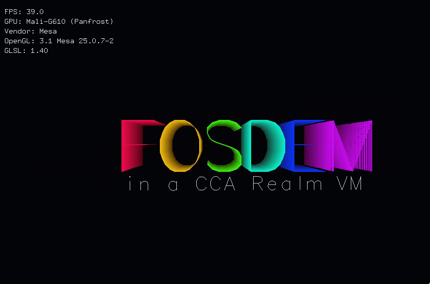

# fosdem2026-opencca

This repository contains the source code for the device demo
shown at FOSDEM2026.

## Links
- [OpenCCA Website](https://opencca.github.io/)
- [OpenCCA Paper](https://opencca.github.io/assets/opencca_systex25.pdf)
- [Live Demo Code](./demo-scripts)
